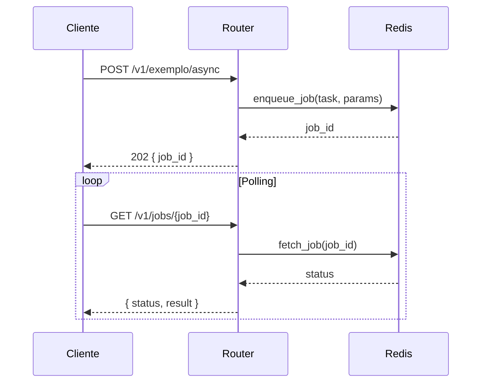
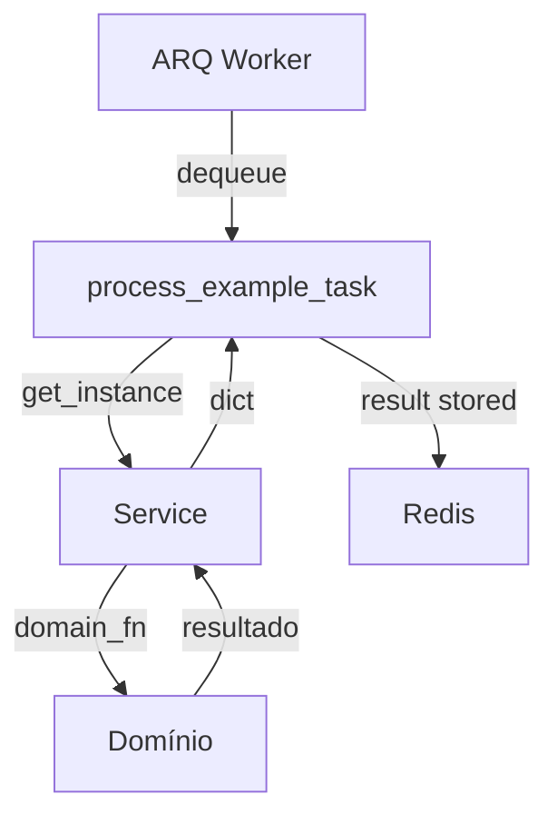

# SKILL: /document-project

**Propósito:** Gerar e manter a documentação do projeto em `docs/`: estrutura de pastas e arquivos,
fluxos de processamento, referência de funções/classes e guia "where was I?" para retomada de
trabalho. Cria os arquivos se não existirem, verifica consistência com o código atual e atualiza
a documentação quando houver divergência.

**Argumento:** sem argumento — opera no projeto atual, analisa `src/`, `utils/`, `scripts/`, `data/`, `tests/` e raiz

**Quando usar:** Quando o utilizador pedir para documentar o projeto, atualizar a documentação
ou verificar se a documentação está correta/condizente com o código.

---

## Definições

| Item | Regra |
|------|--------|
| Local | Todos os arquivos de documentação em `docs/` |
| Obrigatório | `docs/WHERE_WAS_I.md` — sempre presente |
| Padrão de nomes | `STRUCTURE.md`, `FLOW.md`, `REFERENCE.md`, `WHERE_WAS_I.md` |
| Idioma | Português |
| Índice | Não criar `docs/README.md` — WHERE_WAS_I é o ponto de entrada |
| Detalhe | Textos sempre detalhados — sem resumos ou "N/A" |

---

## Procedimento

Sempre que esta skill for executada: (1) ler o que existe em `docs/`, (2) analisar o código no
escopo, (3) comparar com os critérios de consistência, (4) apresentar ao utilizador o que será
criado ou atualizado e aguardar aprovação, (5) criar ou atualizar os arquivos necessários,
(6) validar o resultado.

---

### FASE 1 — Ler estado atual da documentação

1. Listar todos os arquivos em `docs/` (se a pasta não existir, considerar "nenhum doc existente").
2. Para cada um de `STRUCTURE.md`, `FLOW.md`, `REFERENCE.md`, `WHERE_WAS_I.md`:
   - Se existir: ler o conteúdo e guardar mentalmente o que está documentado (pastas, fluxos, funções, entry points).
   - Se não existir: marcar para criação.
3. Garantir que `docs/` existe (criar se necessário ao escrever o primeiro arquivo).

---

### FASE 2 — Analisar o projeto (escopo)

Analisar as seguintes pastas e arquivos:

**Pastas principais (conteúdo detalhado):**
- `src/` — estrutura completa, módulos, responsabilidade de cada pasta/arquivo
- `utils/` — arquivos e propósito
- `scripts/` — scripts e propósito
- `data/` — apenas estrutura (subpastas e propósito; não conteúdo de ficheiros)

**Incluir em STRUCTURE com uma linha cada:**
- `tests/` — uma linha descrevendo a pasta
- Arquivos relevantes da raiz: `pyproject.toml`, `.env.example`, outros que afetem configuração ou entry points

**Fontes auxiliares — ler se existirem:**
- `CLAUDE.md` (raiz) e sub-CLAUDEs (`src/CLAUDE.md`, `scripts/CLAUDE.md`, `tests/CLAUDE.md`,
  `utils/CLAUDE.md`) — contêm decisões arquiteturais, padrões e comandos que devem ser
  refletidos com precisão em `FLOW.md`, `REFERENCE.md` e `WHERE_WAS_I.md`.

**Para REFERENCE:** inspecionar funções e classes públicas em `src/`, `utils/` e `scripts/`;
ler docstrings e comentários existentes no código para refletir na documentação.

**Para FLOW:** identificar endpoints HTTP (síncronos e assíncronos), tasks ARQ registradas,
e scripts de entrada; mapear fluxos request → router → service → domínio e
enfileiramento → task ARQ.

**Para WHERE_WAS_I:** identificar entry points (uvicorn, arq worker, scripts), comandos de
execução e testes, e "onde está cada tipo de lógica" (API, domínio, tasks, scripts).

---

### FASE 3 — Verificar consistência e decidir ações

Comparar o estado analisado (FASE 2) com o estado documentado (FASE 1). Atualizar quando:

| Documento | Atualizar quando |
|-----------|-------------------|
| **STRUCTURE** | Pasta ou arquivo novo, removido ou renomeado |
| **FLOW** | Novo ou removido endpoint, task ARQ ou script de entrada |
| **REFERENCE** | Função/classe nova, removida ou com assinatura/módulo alterado |
| **WHERE_WAS_I** | Mudança em entry points, comandos de run/test ou em "onde está a lógica X" |

Se não existir documento → marcar para criação. Se existir mas houver divergência → marcar para
atualização. Se existir e estiver conforme → marcar como "sem alteração".

---

### FASE 4 — Apresentar plano e aguardar aprovação

Antes de escrever qualquer arquivo, apresentar ao utilizador o resumo das ações planejadas:

```
## Plano de documentação — <projeto>

| Documento | Ação | Motivo |
|-----------|------|--------|
| STRUCTURE.md | criar | não existe |
| FLOW.md | atualizar | novo endpoint /v1/pipeline detectado |
| REFERENCE.md | atualizar | 3 funções novas em kt_indexing/ |
| WHERE_WAS_I.md | sem alteração | conforme |
```

Listar também eventuais divergências encontradas entre documentação existente e código atual.

**Aguardar aprovação explícita do utilizador antes de escrever qualquer arquivo.**
Se o utilizador quiser ajustar o escopo (ex.: "não precisa atualizar REFERENCE agora"),
incorporar a decisão antes de prosseguir para a FASE 5.

---

### FASE 5 — Estrutura: `docs/STRUCTURE.md`

**Conteúdo:**
- Árvore completa de pastas e arquivos para `src/`, `utils/`, `scripts/`, `data/`.
- Incluir `tests/` e ficheiros da raiz com uma linha cada.
- Profundidade máxima: todos os níveis (não limitar).
- Para cada pasta: uma linha descrevendo a responsabilidade.
- Para cada arquivo: uma linha descrevendo o propósito (exceto `__init__.py` vazios — omitir ou citar apenas como "presente").
- `__init__.py` com conteúdo (exports, lógica): documentar como os demais arquivos.
- Itens removidos do código devem ser removidos da árvore — não deixar entradas obsoletas.

**Formato:** listas em Markdown, indentação clara, texto em português, descrições detalhadas.

---

### FASE 6 — Fluxo: `docs/FLOW.md`

**Conteúdo:**
- Diagrama em **Mermaid** obrigatório para cada tipo de fluxo presente no projeto.
- Texto explicativo em português para cada fluxo: passos, componentes envolvidos, ordem de chamadas.
- Documentar: endpoints HTTP (síncrono e assíncrono), tasks ARQ (nome, onde são registradas, o que fazem).
- Sempre criar conteúdo detalhado — não usar "N/A" ou resumo mínimo.

**Tipos de diagrama Mermaid por fluxo:**

| Fluxo | Tipo obrigatório | Motivo |
|-------|-----------------|--------|
| HTTP síncrono | `flowchart LR` | Mostra a cadeia linear cliente → router → service → domínio |
| HTTP assíncrono (job) | `sequenceDiagram` | Mostra o ciclo enqueue → polling → resultado entre cliente e stack |
| Tasks ARQ (worker) | `flowchart TD` | Mostra o fluxo interno da task: ctx → service → domínio → retorno |

**Exemplo de secção (adaptar ao projeto):**
```markdown
## Fluxo HTTP síncrono

```mermaid
flowchart LR
    Cliente -->|POST /v1/exemplo| Router
    Router -->|service.process()| Service
    Service -->|domain_fn()| Domínio
    Domínio -->|resultado| Service
    Service -->|ExampleResponse| Router
    Router -->|200 OK| Cliente
```
[Texto explicativo]

## Fluxo HTTP assíncrono (job)


[Texto explicativo]

## Fluxo das tasks ARQ


[Texto explicativo]
```

---

### FASE 7 — Referência: `docs/REFERENCE.md`

**Conteúdo:**
- Funções e classes **públicas** de módulos em `src/`, `utils/` e `scripts/`.
- Refletir as **docstrings e comentários já existentes no código** — não inventar descrições; usar o que está nos arquivos.
- Por módulo: listar funções/classes com nome, assinatura (parâmetros e retorno quando relevante) e descrição breve baseada no código.
- Texto em português; descrições detalhadas quando o código já as tiver.
- Funções ou classes removidas do código devem ser removidas do REFERENCE — não deixar entradas obsoletas.

**Formato:** cabeçalhos por módulo ou pasta, lista de funções/classes com assinatura e descrição.

---

### FASE 8 — Where was I: `docs/WHERE_WAS_I.md`

**Propósito deste documento:** Guiar qualquer pessoa ou IA a retomar o trabalho no projeto após
uma pausa (melhorias, ajustes, implementação interrompida). Cenários: desenvolvedor que parou e
volta; IA que perde contexto; troca de IA. O utilizador deve poder consultar este documento
(com ou sem IA) para continuar a implementação com clareza do estado atual do sistema.

**Conteúdo obrigatório (em português, detalhado):**
- **Estado atual do projeto:** o que já está implementado e estável; o que está em progresso ou pendente.
- **Entry points:** como iniciar a aplicação (ex.: `uvicorn src.api.main:app`,
  `arq src.tasks.arq_worker.WorkerSettings`), scripts em `scripts/` que são pontos de entrada.
- **Como rodar e testar:** comandos para executar a aplicação e os testes
  (ex.: `pytest tests/`, `pytest tests/ -m smoke`, `pytest tests/ -m e2e`).
- **Onde está cada tipo de lógica:** onde fica a API (routers, main), domínio (pastas em `src/`),
  tasks ARQ, scripts, configuração; referências concretas (pastas/arquivos).
- **Links para os outros documentos:** referência a [STRUCTURE.md](STRUCTURE.md),
  [FLOW.md](FLOW.md), [REFERENCE.md](REFERENCE.md) para quem quiser aprofundar.

**Relação com `CLAUDE.md`:** `WHERE_WAS_I.md` **complementa** o `CLAUDE.md` — não duplica.
O `CLAUDE.md` é a fonte de verdade para padrões do time e comandos canônicos. O `WHERE_WAS_I.md`
documenta o **estado atual** do projeto (o que está feito, o que está pendente, onde está
cada lógica). Comandos de execução devem ser copiados literalmente do `CLAUDE.md` (seção
"Commands") — nunca reformulados ou inferidos, para evitar drift.

Atualizar sempre que houver mudança em entry points, comandos de run/test ou na organização
da lógica do projeto.

---

### FASE 9 — Escrever ou atualizar os arquivos

1. Para cada arquivo em `docs/` aprovado na FASE 4:
   - Gerar o conteúdo conforme as FASEs 5 a 8.
   - Escrever em `docs/` com o nome correto (`STRUCTURE.md`, `FLOW.md`, `REFERENCE.md`, `WHERE_WAS_I.md`).
2. Garantir que `docs/WHERE_WAS_I.md` existe sempre — se não existir, criar; se existir e estiver desatualizado, atualizar.
3. Revisar: tudo em português, sem resumos vagos, com o nível de detalhe definido.

---

### FASE 10 — Validação

Após escrever, verificar:

```
[ ] docs/WHERE_WAS_I.md existe e tem conteúdo não-vazio
[ ] docs/STRUCTURE.md existe e contém ao menos as seções src/, utils/, scripts/
[ ] docs/FLOW.md existe e contém pelo menos um bloco ```mermaid```
[ ] docs/REFERENCE.md existe e lista ao menos um módulo de src/
[ ] WHERE_WAS_I.md tem as seções obrigatórias: estado atual, entry points, como rodar/testar, onde está cada lógica, links
[ ] Nenhum documento referencia pasta ou arquivo que não existe mais no projeto
[ ] Comandos em WHERE_WAS_I.md batem com a seção "Commands" do CLAUDE.md
```

Reportar ao utilizador: quantos documentos foram criados, quantos atualizados, e confirmar
que a validação passou. Se algum item falhar, corrigir antes de encerrar.

---

## Critérios de conclusão

- `docs/` existe e contém pelo menos `WHERE_WAS_I.md`.
- `STRUCTURE.md`, `FLOW.md`, `REFERENCE.md` existem e estão alinhados com o projeto (criados ou atualizados conforme análise).
- STRUCTURE: árvore completa (src, utils, scripts, data, tests, raiz); uma linha por item; `__init__.py` vazios omitidos ou só citados; nenhuma entrada obsoleta.
- FLOW: diagrama Mermaid presente com tipo correto por fluxo (`flowchart LR`, `sequenceDiagram`, `flowchart TD`); HTTP síncrono/assíncrono e tasks ARQ documentados; texto detalhado.
- REFERENCE: funções/classes públicas de `src/`, `utils/` e `scripts/`; descrições refletem docstrings/comentários do código; nenhuma entrada obsoleta.
- WHERE_WAS_I: estado atual, entry points, como rodar/testar, onde está cada lógica, links para os outros docs; comandos alinhados com `CLAUDE.md`; conteúdo detalhado em português.
- Validação da FASE 10 concluída sem itens pendentes.

---

## FASE FINAL — Registro de feedback

Ao concluir, registrar entrada em `.claude/skills-feedback/document-project.md`:

```markdown
## [YYYY-MM-DD] Projeto: <nome>

**Documentos criados:** <lista>
**Documentos atualizados:** <lista>
**Documentos sem alteração:** <lista>

**O que funcionou bem:**
- <ponto positivo>

**O que foi difícil:**
- <ponto de atrito>

**Sugestão de melhoria para esta SKILL:**
- <proposta>
```
