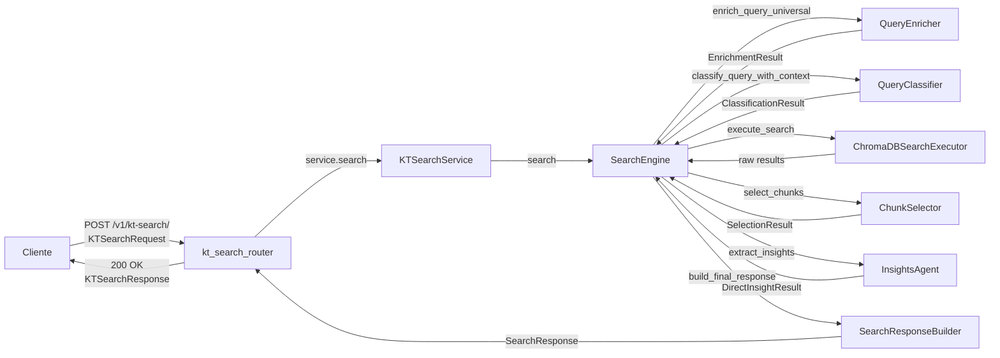
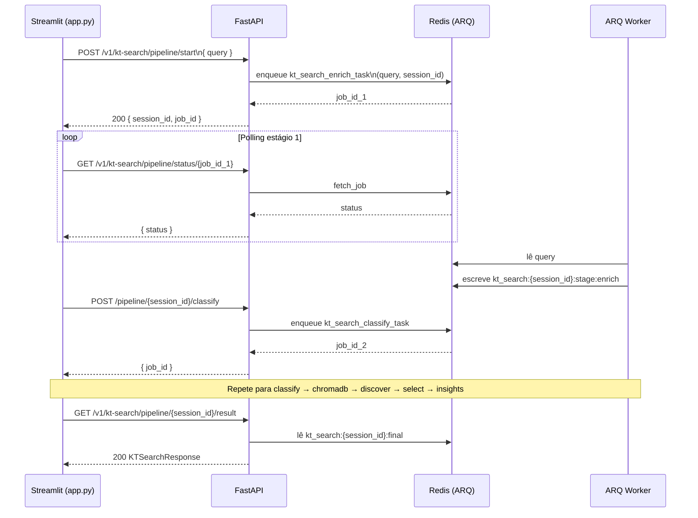
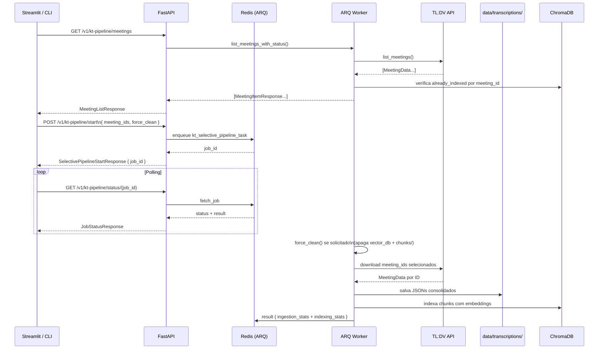
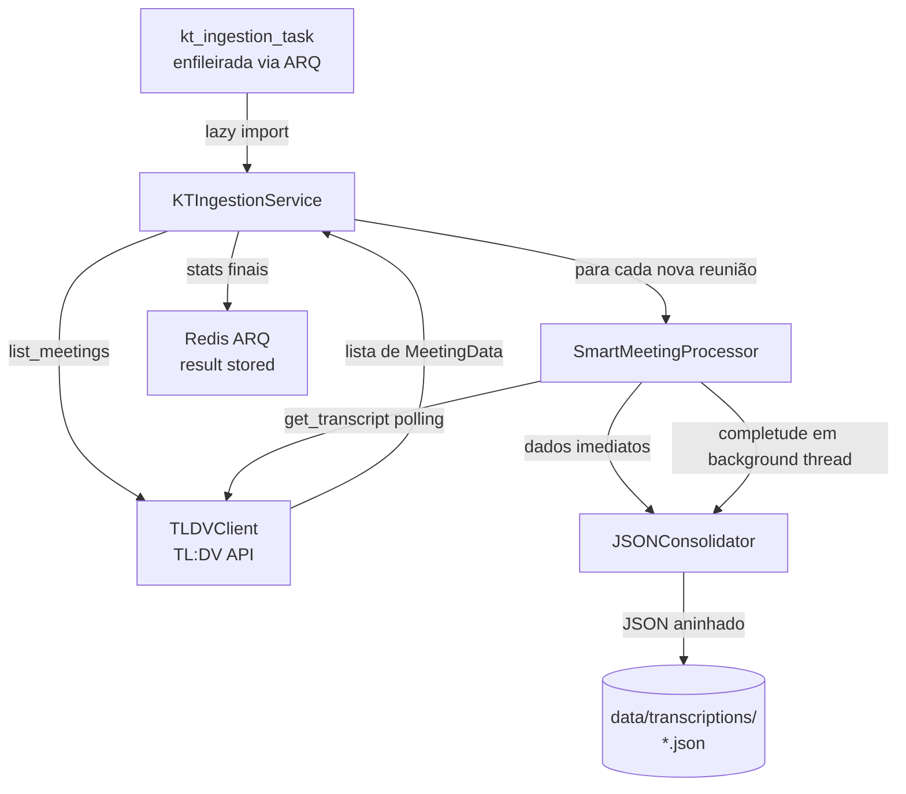
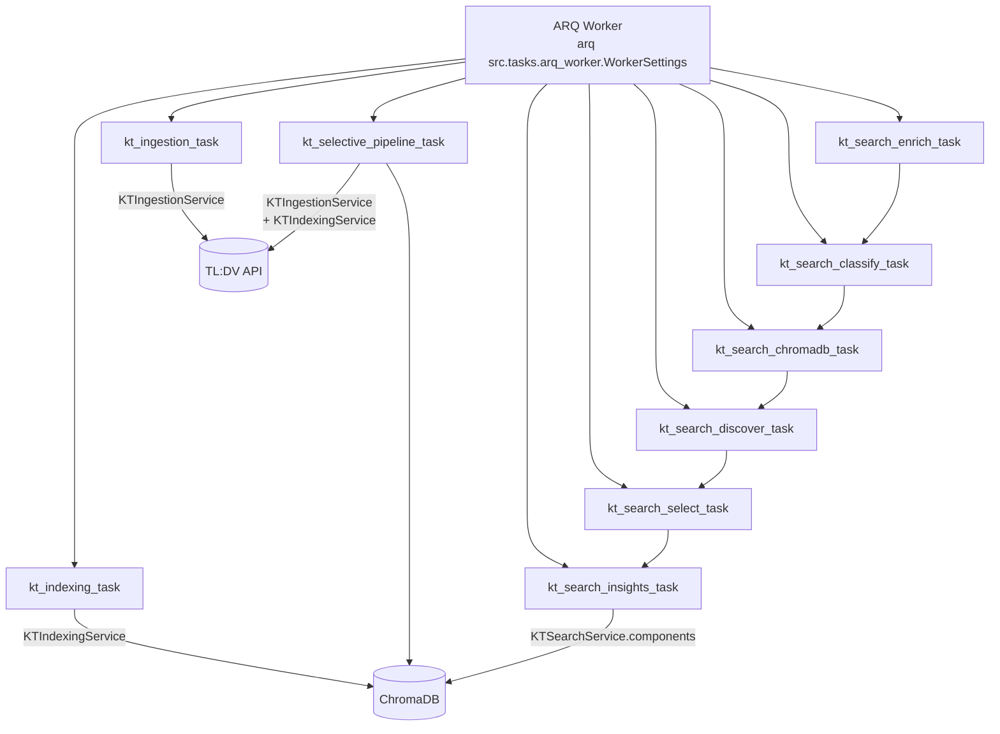

# Fluxos do Sistema — KT-Transcriber

Documentação dos fluxos de processamento. Gerado por `/document-project`.

---

## Fluxo 1 — Busca RAG Síncrona (`POST /v1/kt-search/`)

Usado por clientes que podem aguardar a resposta HTTP diretamente (ex.: integração Teams, CLI interna).



**Passos detalhados:**

1. **Router** recebe `KTSearchRequest(query)` e delega ao `KTSearchService` (singleton).
2. **KTSearchService** chama `SearchEngine.search(query)`, que executa os estágios em sequência.
3. **Estágio 1 — Enriquecimento** (`QueryEnricher`): detecta entidades (clientes, transações SAP, módulos, participantes, temporal), normaliza a query e constrói contexto semântico.
4. **Estágio 2 — Classificação** (`QueryClassifier`): classifica o tipo de busca RAG (`SEMANTIC`, `METADATA`, `ENTITY`, `TEMPORAL`, `CONTENT`) com confidence e fallbacks para queries híbridas.
5. **Estágio 3 — Busca ChromaDB** (`ChromaDBSearchExecutor`): executa até 5 estratégias de busca paralelamente. Detecta early-exit se o cliente mencionado na query não existe no ChromaDB.
6. **Estágio 4 — Seleção** (`ChunkSelector`): aplica scoring de qualidade + diversidade e seleciona TOP-K chunks adaptativos ao tipo de query.
7. **Estágio 5 — Insights** (`InsightsAgent`): gera resposta final via GPT-4o-mini consolidando os chunks selecionados em uma resposta acionável.
8. **SearchResponseBuilder** monta `KTSearchResponse` com `answer`, `contexts`, `query_type` e `processing_time`.

---

## Fluxo 2 — Busca RAG Assíncrona — Pipeline de 6 Estágios

Usado pela UI Streamlit para exibir progress bar em tempo real. Cada estágio é uma task ARQ independente que persiste estado no Redis.



**Passos detalhados:**

1. **Estágio 1 — Enriquecimento** (`kt_search_enrich_task`): lê query, executa `QueryEnricher`, salva `EnrichmentResult` em `kt_search:{session_id}:stage:enrich` no Redis.
2. **Estágio 2 — Classificação** (`kt_search_classify_task`): lê enrich do Redis, classifica tipo RAG, salva `ClassificationResult` em `kt_search:{session_id}:stage:classify`.
3. **Estágio 3 — Busca ChromaDB** (`kt_search_chromadb_task`): lê enrich + classify do Redis, executa 5 estratégias de busca, aplica early-exit se cliente inexistente, salva resultados brutos.
4. **Estágio 4 — Descoberta** (`kt_search_discover_task`): descoberta dinâmica de clientes (apenas para queries ENTITY/METADATA), salva `discovered_clients`.
5. **Estágio 5 — Seleção** (`kt_search_select_task`): lê resultados brutos, aplica quality + diversity scoring, salva TOP-K chunks selecionados.
6. **Estágio 6 — Insights** (`kt_search_insights_task`): gera resposta final via GPT, salva `KTSearchResponse` em `kt_search:{session_id}:final` para consumo pelo endpoint `/result`.

A Streamlit faz polling de cada job via `GET /pipeline/status/{job_id}` com early-exit detection (se estágio retornar `no_results`, interrompe a cadeia antes do Insights).

---

## Fluxo 3 — Pipeline Seletivo (Ingestion + Indexação de Reuniões Escolhidas)

Permite indexar reuniões específicas do TL:DV sem reprocessar toda a base.



**Passos detalhados:**

1. **Listagem** (`GET /v1/kt-pipeline/meetings`): `KTIngestionService.list_meetings_with_status()` combina a lista do TL:DV API com o ChromaDB para marcar `already_indexed=True/False` por `meeting_id`.
2. **Enfileiramento** (`POST /v1/kt-pipeline/start`): router enfileira `kt_selective_pipeline_task` com `meeting_ids`, `session_id` e `force_clean`.
3. **Execução do Worker**:
   - Se `force_clean=True`: `kt_indexing_service.force_clean()` apaga a coleção ChromaDB e a pasta `chunks/`.
   - `kt_ingestion_service.run_selective_ingestion(meeting_ids)`: baixa apenas as reuniões selecionadas.
   - `kt_indexing_service.run_indexing()`: indexa incrementalmente todos os JSONs não indexados.
4. **Resultado**: stats combinados de ingestion (meetings_downloaded) + indexing (chunks_indexed) ficam disponíveis via polling.

---

## Fluxo 4 — Ingestion Completa

Baixa todas as reuniões novas do TL:DV de forma incremental.



**Componentes**:
- `TLDVClient.list_meetings()` — retorna todas as reuniões; KTIngestionService filtra as já salvas em disco por `meeting_id`.
- `SmartMeetingProcessor` — processa em duas fases: dados imediatos (não bloqueante) + completude de transcrição em background thread.
- `JSONConsolidator` — salva formato aninhado: `metadata` + `transcript.segments[]` + `highlights[]`.

---

## Fluxo 5 — Indexação

Processa JSONs em disco e indexa no ChromaDB.

```mermaid
flowchart TD
    Trigger[kt_indexing_task\nenfileirada via ARQ] -->|lazy import| Service[KTIndexingService]
    Service -->|process_all_videos| Engine[IndexingEngine]
    Engine -->|para cada JSON novo| Norm[EnhancedVideoNormalizer\nslug semântico]
    Norm -->|slug + modules| Engine
    Engine -->|split_segment_into_parts| Chunker[TextChunker\n1000 chars + 200 overlap]
    Chunker -->|ChunkPart[]| Engine
    Engine -->|extract_metadata_for_chunk| LLM[LLMMetadataExtractor\nGPT-4o-mini]
    LLM -->|meeting_phase, sap_modules,\ntransactions, tags...| Engine
    Engine -->|generate_chunk_embedding| Embedder[EmbeddingGenerator\nOpenAI text-embedding-3-small]
    Embedder -->|embedding 1536D| Engine
    Engine -->|add_chunk| Store[ChromaDBStore\ndata/vector_db/]
    Engine -->|create_chunk_txt_file| TXT[(data/transcriptions/chunks/\n*.txt auditoria)]
    Service -->|stats| ARQ[Redis ARQ\nresult stored]
```

**Componentes**:
- `EnhancedVideoNormalizer` — gera slug `{cliente}_{modulo}_{data}` (ex: `dexco_ewm_20250822`). Regras: `[BRACKET]` → lowercase; sem bracket → `"dexco"`. Módulo: regex SAP → keyword map → fallback LLM.
- `TextChunker` — divide por segmento: máx 1000 chars, sobreposição 200 chars, mínimo 50 chars.
- `LLMMetadataExtractor` — extrai 10 campos por chunk via GPT-4o-mini (temperatura 0.1, 3 retries).
- `EmbeddingGenerator` — embedding híbrido: 80% conteúdo + 20% contexto de metadados concatenado.
- `ChromaDBStore` — `PersistentClient` em `data/vector_db/`; `_clean_metadata()` remove campos `None` antes de inserir (ChromaDB rejeita None como MetadataValue).

---

## Tasks ARQ registradas

Todas as tasks estão em `src/tasks/arq_worker.py` → `WorkerSettings.functions`.



| Task | Propósito | Service usado |
|------|-----------|---------------|
| `kt_ingestion_task` | Download incremental de reuniões TL:DV | `KTIngestionService` |
| `kt_indexing_task` | Indexação incremental de JSONs no ChromaDB | `KTIndexingService` |
| `kt_selective_pipeline_task` | force_clean + ingestion seletiva + indexação | `KTIngestionService` + `KTIndexingService` |
| `kt_search_enrich_task` | Enriquecimento da query (estágio 1) | `KTSearchService.components` |
| `kt_search_classify_task` | Classificação do tipo RAG (estágio 2) | `KTSearchService.components` |
| `kt_search_chromadb_task` | Busca no ChromaDB — 5 estratégias (estágio 3) | `KTSearchService.components` |
| `kt_search_discover_task` | Descoberta dinâmica de clientes (estágio 4) | `KTSearchService.components` |
| `kt_search_select_task` | Seleção de TOP-K chunks (estágio 5) | `KTSearchService.components` |
| `kt_search_insights_task` | Geração de insights via GPT (estágio 6) | `KTSearchService.components` |
